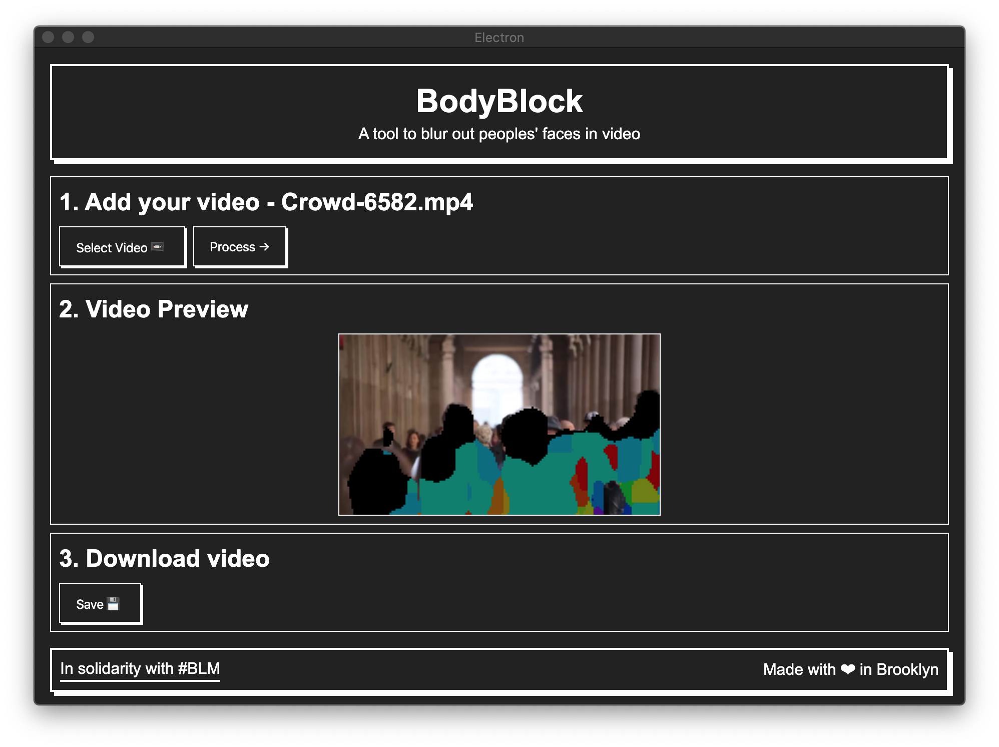

# BodyBlock
> A desktop app that helps to hide faces and body parts from video



## User Guide

TBD - guide to come once an alpha or beta release is made


## Contribute

If you'd like to make contributions to building the application, you can do so by setting up your development environment and making changes to the code. 

This project is based off the [electron-webpack-starter](https://github.com/electron-userland/electron-webpack) which uses [`electron-webpack`](https://github.com/electron-userland/electron-webpack).

Electron Webpack is:
> A bare minimum project structure to get started developing with [`electron-webpack`](https://github.com/electron-userland/electron-webpack).

To get the app running locally for development:

### 1 - Install your dependencies

```bash
# install dependencies
yarn
```

### 2 - Run the app in development

```sh
# run application in development mode
yarn dev
```

### 🚀 Build the app for production

```sh
# compile source code and create webpack output
yarn compile

# `yarn compile` & create build with electron-builder
yarn dist

# `yarn compile` & create unpacked build with electron-builder
yarn dist:dir
```

## Authors
* @shiffman - Daniel Shiffman
* @joeyklee - Joey Lee

## Contributors
* @dancigrang
* @TheNullicorn